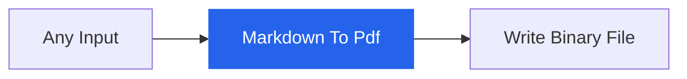

<div align="center">

# n8n-nodes-medhira

**Convert Markdown to beautiful PDFs inside n8n — free, self-hosted, and production-ready.**

[](https://www.npmjs.com/package/n8n-nodes-medhira)
[](https://www.apache.org/licenses/LICENSE-2.0)
[](https://medhira.readthedocs.io/en/latest/)

<br />


<br /><br />

[Documentation](https://medhira.readthedocs.io/en/latest/n8n-nodes-medhira/) · [NPM](https://www.npmjs.com/package/n8n-nodes-medhira) · [GitHub](https://github.com/HELLOMEDHIRA/n8n-nodes-medhira) · [Report Issue](https://github.com/HELLOMEDHIRA/n8n-nodes-medhira/issues)

</div>

---

## Why this node?

Turn Markdown into polished PDF documents directly in your n8n workflows — no paid nodes, no external services.

| Feature | Supported |
|---------|-----------|
| Headers, lists, tables, blockquotes | Yes |
| Syntax-highlighted code blocks | Yes |
| LaTeX math formulas (KaTeX) | Yes |
| Batch processing (multiple items) | Yes |
| Custom file names & page formats | Yes |
| Self-hosted n8n | Yes |

---

## Quick start

### Install

<details>
<summary><strong>Docker</strong></summary>

```bash
docker exec -it n8n sh
mkdir -p ~/.n8n/nodes && cd ~/.n8n/nodes
npm install n8n-nodes-medhira
exit
docker restart n8n
```

</details>

<details>
<summary><strong>npx n8n</strong></summary>

```bash
mkdir -p ~/.n8n/nodes && cd ~/.n8n/nodes
npm install n8n-nodes-medhira
npx n8n
```

</details>

<details>
<summary><strong>Global n8n</strong></summary>

```bash
mkdir -p ~/.n8n/nodes && cd ~/.n8n/nodes
npm install n8n-nodes-medhira
n8n
```

</details>

> **Note:** Community nodes require **self-hosted n8n**. n8n Cloud is not supported.

### Use in a workflow

1. Press `Ctrl+K` (or `Cmd+K`) → search **Markdown To Pdf**
2. Paste or pass Markdown content
3. Connect to **Write Binary File** to save the PDF



---

## Example

**Input Markdown:**

````markdown
# Quarterly Report

Revenue grew **24%** year over year.

## Formula

$$E = mc^2$$

## Code

```javascript
console.log("Hello from n8n!");
```
````

**Output:**

| Field | Example |
|-------|---------|
| `json.fileName` | `file-1.pdf` |
| `json.size` | `48213` |
| `binary.data` | PDF file (application/pdf) |

---

## Configuration

| Option | Default | Description |
|--------|---------|-------------|
| **Markdown** | — | Markdown text to convert |
| **File Name** | `file-{{ $index }}` | Output PDF name |
| **PDF Format** | A4 | A4, Letter, or Legal |

Markdown can also arrive from a previous node via `json.markdown`.

Full guides: [Installation](https://medhira.readthedocs.io/en/latest/n8n-nodes-medhira/installation/) · [Usage](https://medhira.readthedocs.io/en/latest/n8n-nodes-medhira/usage/) · [Configuration](https://medhira.readthedocs.io/en/latest/n8n-nodes-medhira/configuration/)

---

## Requirements

- Node.js **18+**
- Self-hosted **n8n**
- Puppeteer system libraries (see [Installation guide](https://medhira.readthedocs.io/en/latest/n8n-nodes-medhira/installation/#puppeteer-system-dependencies))

---

## License

Licensed under the [Apache License 2.0](https://www.apache.org/licenses/LICENSE-2.0).

---

<div align="center">

Made with care by **[MEDHIRA](https://medhira.readthedocs.io/en/latest/)**

[hello.medhira@gmail.com](mailto:hello.medhira@gmail.com)

</div>
