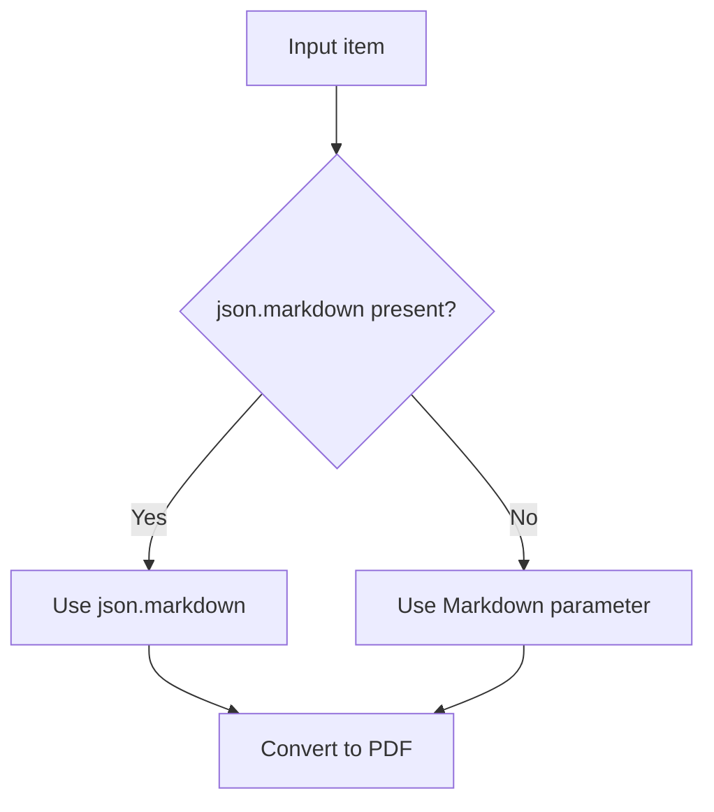

# Configuration

Configure the **Markdown To Pdf** node to control PDF output.

---

## Node options

| Option | Type | Default | Description |
|--------|------|---------|-------------|
| **Markdown** | string | *(empty)* | Markdown content to convert. Can also be supplied via input JSON field `markdown`. |
| **File Name** | string | `file-{{ $index }}` | Output PDF file name. Use `{{ $index }}` for the 1-based item number. The `.pdf` extension is added automatically if omitted. |
| **PDF Format** | option | A4 | Page size: **A4**, **Letter**, or **Legal** |

---

## PDF defaults

These settings are applied automatically and require no extra configuration:

| Setting | Value |
|---------|-------|
| Orientation | Portrait |
| Top / bottom margin | 20 mm |
| Left / right margin | 15 mm |
| Background graphics | Enabled (printed) |
| Font | Arial, sans-serif |
| Content width | Max 800 px, centered |

---

## Input priority

When both sources are available, the node resolves Markdown in this order:



---

## File naming examples

| File Name setting | Item index | Result |
|-------------------|------------|--------|
| `file-{{ $index }}` | 0 | `file-1.pdf` |
| `report-{{ $index }}` | 2 | `report-3.pdf` |
| `invoice.pdf` | any | `invoice.pdf` |

---

## Output

| Field | Description |
|-------|-------------|
| `json.fileName` | Generated PDF file name |
| `json.size` | File size in bytes |
| `binary.data` | PDF binary content (`application/pdf`) |

---

## Error handling

Enable **Continue On Fail** on the node to process remaining items when one fails. Failed items output:

```json
{
  "error": "Markdown input is empty or invalid"
}
```

---

## Related guides

- [Installation](installation.md)
- [Usage](usage.md)
