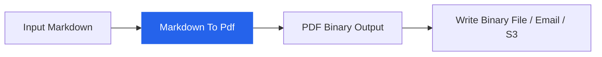

# n8n-nodes-medhira

<div align="center">

**Convert Markdown to beautiful PDFs inside n8n — free, self-hosted, and production-ready.**

[](https://www.npmjs.com/package/n8n-nodes-medhira)
[](https://www.apache.org/licenses/LICENSE-2.0)
[](https://medhira.readthedocs.io/en/latest/)


</div>

---

## Overview

The **Markdown To Pdf** node converts Markdown text into styled PDF documents using Puppeteer. It supports syntax-highlighted code, LaTeX math via KaTeX, tables, and batch processing — all within your n8n workflow.



---

## Features

| Feature | Details |
|---------|---------|
| **Rich Markdown** | Headers, lists, tables, blockquotes, links |
| **Syntax highlighting** | Code blocks rendered with Highlight.js |
| **Math formulas** | Inline and block LaTeX via bundled KaTeX |
| **Batch processing** | Process multiple input items in one run |
| **Configurable output** | Custom file names and page formats (A4, Letter, Legal) |
| **Self-hosted** | Works with Docker, npx, and global n8n installs |

---

## Quick install

```bash
mkdir -p ~/.n8n/nodes && cd ~/.n8n/nodes
npm install n8n-nodes-medhira
```

Restart n8n, then search for **Markdown To Pdf** in the node panel.

See the full [Installation Guide](installation.md) for Docker, npx, and troubleshooting steps.

---

## Quick usage

1. Add the **Markdown To Pdf** node to your workflow
2. Enter Markdown in the node, or pass it from a previous node as `json.markdown`
3. Connect to **Write Binary File** to save the PDF


---

## Documentation

| Guide | Description |
|-------|-------------|
| [Installation](installation.md) | Install on Docker, npx, or global n8n |
| [Usage](usage.md) | Workflow examples and input/output reference |
| [Configuration](configuration.md) | PDF settings and node options |

---

## Links

- [GitHub Repository](https://github.com/HELLOMEDHIRA/n8n-nodes-medhira)
- [NPM Package](https://www.npmjs.com/package/n8n-nodes-medhira)
- [MEDHIRA](https://medhira.readthedocs.io/en/latest/)
- [Contact](mailto:hello.medhira@gmail.com)

---

## License

Licensed under the [Apache License 2.0](https://www.apache.org/licenses/LICENSE-2.0).

---

<div align="center">

Made with care by **[MEDHIRA](https://medhira.readthedocs.io/en/latest/)**

</div>
