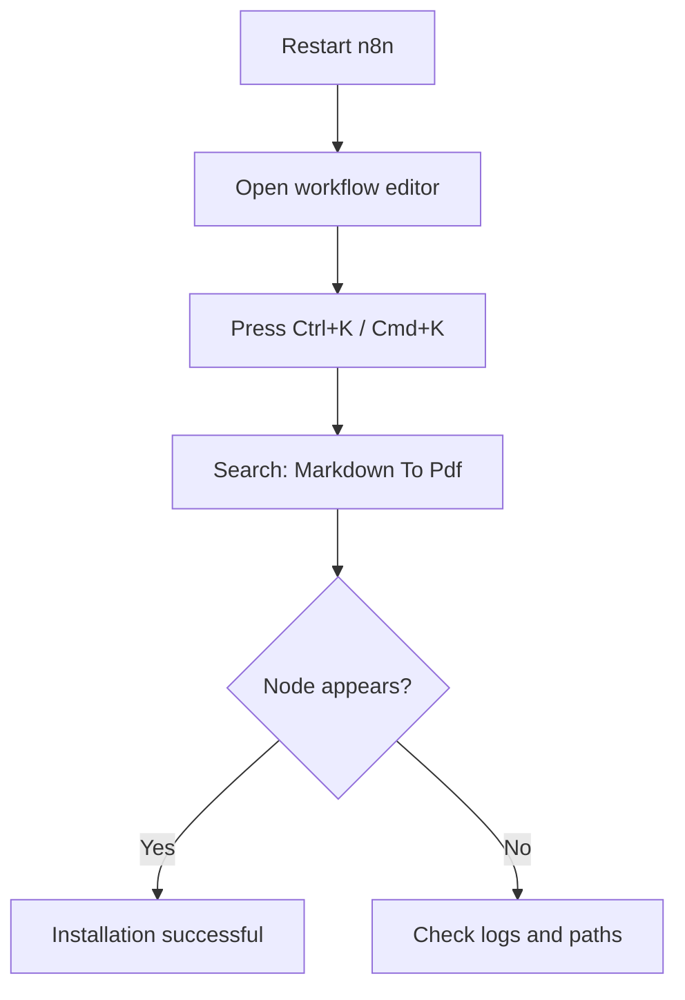

# Installation

Install the **Markdown To Pdf** community node on your self-hosted n8n instance.

!!! note "Self-hosted only"
    Community nodes are supported on **self-hosted n8n** only. n8n Cloud does not support custom community node installation via the filesystem.

---

## Prerequisites

| Requirement | Version | Notes |
|-------------|---------|-------|
| [Node.js](https://nodejs.org/) | 18+ | LTS recommended |
| [n8n](https://n8n.io/) | Self-hosted | Docker, npx, or global install |

---

## Install methods

=== "Docker"

    ```bash
    docker exec -it n8n sh
    mkdir -p ~/.n8n/nodes && cd ~/.n8n/nodes
    npm install n8n-nodes-medhira
    exit
    docker restart n8n
    ```

=== "npx n8n"

    ```bash
    mkdir -p ~/.n8n/nodes && cd ~/.n8n/nodes
    npm install n8n-nodes-medhira
    ```

    Stop n8n (`Ctrl+C`) and restart:

    ```bash
    npx n8n
    ```

=== "Global n8n"

    ```bash
    mkdir -p ~/.n8n/nodes && cd ~/.n8n/nodes
    npm install n8n-nodes-medhira
    ```

    Stop and restart n8n:

    ```bash
    n8n
    ```

=== "In-app (Community Nodes)"

    1. Open n8n in your browser
    2. Go to **Settings → Community Nodes**
    3. Enter package name: `n8n-nodes-medhira`
    4. Click **Install**

---

## Verify installation



1. Open n8n and create or edit a workflow
2. Press `Ctrl+K` (or `Cmd+K` on Mac)
3. Search for **Markdown To Pdf**
4. The node should appear in the results

---

## Puppeteer system dependencies

Puppeteer ships with Chromium. On minimal Linux/Docker images you may need extra libraries:

=== "Ubuntu / Debian"

    ```bash
    apt-get update && apt-get install -y \
        libnss3 \
        libatk1.0-0 \
        libatk-bridge2.0-0 \
        libcups2 \
        libdrm2 \
        libxkbcommon0 \
        libxcomposite1 \
        libxdamage1 \
        libxfixes3 \
        libxrandr2 \
        libgbm1 \
        libasound2
    ```

=== "Alpine Linux"

    ```bash
    apk add --no-cache \
        chromium \
        nss \
        freetype \
        harfbuzz \
        ca-certificates \
        ttf-freefont
    ```

---

## Upgrade

```bash
cd ~/.n8n/nodes
npm update n8n-nodes-medhira
```

Restart n8n after upgrading.

---

## Uninstall

```bash
cd ~/.n8n/nodes
npm uninstall n8n-nodes-medhira
```

Restart n8n to remove the node from the editor.

---

## Troubleshooting

### Community nodes not loading

- Confirm you are on **self-hosted n8n** (not n8n Cloud)
- Restart n8n after installation
- Check logs: `docker logs n8n`

### Puppeteer / Chromium errors

Install the [system dependencies](#puppeteer-system-dependencies) for your OS, then restart n8n.

### Permission denied

```bash
sudo chown -R $(whoami) ~/.n8n
```

---

## Next steps

- [Usage Guide](usage.md) — workflow examples
- [Configuration](configuration.md) — PDF options
