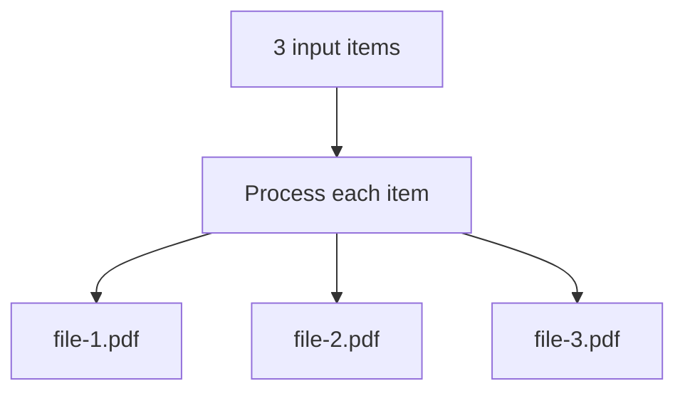

# Usage

Learn how to use the **Markdown To Pdf** node in your n8n workflows.

---

## Add the node

1. Press `Ctrl+K` (or `Cmd+K` on Mac) to open the node search
2. Type **Markdown To Pdf**
3. Select the node and add it to your workflow

---

## Provide Markdown input

You can supply Markdown in two ways:

=== "Node parameter"

    Enter Markdown directly in the **Markdown** field:

    ```markdown
    # Document Title

    This is a paragraph with **bold** and *italic* text.

    ## Features
    - Feature 1
    - Feature 2
    - Feature 3
    ```

=== "Previous node (JSON)"

    Pass Markdown from an upstream node using the `markdown` JSON field:

    ```json
    {
      "markdown": "# Hello\n\nGenerated from webhook."
    }
    ```

    The node checks `json.markdown` first, then falls back to the **Markdown** parameter.

---

## Save the PDF

Connect the node to **Write Binary File**:


In **Write Binary File**:

| Field | Value |
|-------|-------|
| **File Name** | `{{ $json.fileName }}` |
| **Data Property Name** | `data` |

---

## Complete workflow example


1. **Webhook** receives Markdown in the request body
2. **Markdown To Pdf** converts it to a PDF
3. **Write Binary File** saves the file to disk

---

## Advanced examples

### Mathematical formulas

Inline: `$E = mc^2$`

Block:

```
$$
\int_{-\infty}^{\infty} e^{-x^2} dx = \sqrt{\pi}
$$
```

### Tables

```markdown
| Header 1 | Header 2 |
|----------|----------|
| Cell 1   | Cell 2   |
```

### Syntax-highlighted code

````markdown
```javascript
function hello() {
  return "Hello, World!";
}
```
````

Supported languages depend on [Highlight.js](https://highlightjs.org/) — common languages like JavaScript, Python, SQL, and Bash work out of the box.

---

## Output reference

Each processed item produces:

| Field | Type | Description |
|-------|------|-------------|
| `json.fileName` | string | PDF file name (e.g. `file-1.pdf`) |
| `json.size` | number | File size in bytes |
| `binary.data` | binary | PDF content (`application/pdf`) |

When **Continue On Fail** is enabled and an item fails, the output includes `json.error` instead of binary data for that item.

---

## Batch processing

When multiple input items arrive, the node processes each one and outputs a PDF per item:



Customize names with the **File Name** option (default: `file-{{ $index }}`).

---

## Troubleshooting

### "Markdown input is empty or invalid"

- Ensure the **Markdown** field is not empty
- If using a previous node, confirm the JSON contains a `markdown` key with non-empty text

### PDF is blank or missing content

- Verify Markdown syntax is valid
- Check that special characters are properly escaped in expressions

### Binary data not found downstream

- Use `data` as the binary property name in downstream nodes
- Ensure intermediate nodes (Set, Code) are configured to pass binary data through

---

## Next steps

- [Configuration](configuration.md) — PDF format and file naming options
